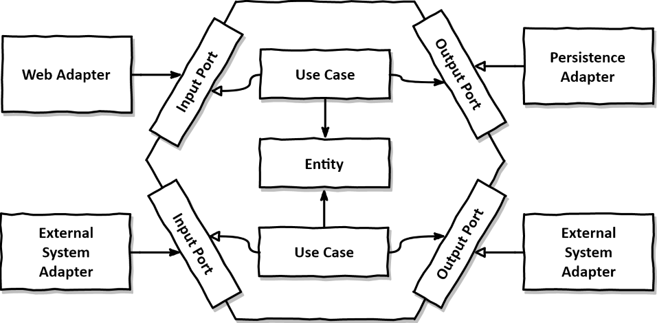

<!-- SPECKIT START -->
For additional context about technologies to be used, project structure,
shell commands, and other important information, read the current plan
<!-- SPECKIT END -->

---
## 📌 Visão Geral do projeto
Este projeto implementa uma solução de um sistema baseada em microsserviços utilizando Java/Spring Boot dividido em microsserviços, API Gateway para gerenciamento de requisições e para atuar como fonte de acesso aos serviços, fornecendo uma ponte para a interação com os microsserviços e além de ser o responsavel pela autenticação e autorização das rotas e cache com Redis para armazenamento do token de autenticação JWT. Também conta com um serviço de descoberta (Service Discovery) para garantir que os microsserviços se encontrem. A comunicação entre alguns microsserviços que precisam se comunicar se dá de forma síncrona a partir do Feign Client mas também conta com mensageria e fila com RabbitMQ no microsserviço de notificação.

--- 

## Dominio de Negocio:

### Contexto
Sistema para uma sala comercial onde o dono subloca essa sua sala comercial para profissionais (psicologos) atenderem seus pacientes. O valor do aluguel é cobrado a cada profissional por uma porcentagem por cada atendimento realizado. 

### Problema que visa resolver
Atualmente o controle de horários para atendimento dos pacientes é feito a partir de uma planilha Excel compartilhada entre os profissionais, que vão marcando seus atendimentos mensalmente, conforme os horários e dias que estão vagos, resultando em um processo trabalhoso e propenso a erros.

### Solução proposta
A solução proposta envolve a criação de um sistema de agendamento online que facilite a o agendamento das sessões dos pacientes mais facilmente por parte dos profissionais. O profissional poderá verificar para aquela data quais horaários estarão livres para poder agendar a sessão do seu paciente, e aqui já vemos que o sistema não deve permitir agendamentos de horários conflitantes de pacientes e profissionais distintos.
Existem dois papéis no sistema: Admin e Profissional
O papel de Admin tem acessos totais ao sistema, podendo gerenciar profissionais e visualizar historico de agendamentos mas sem muitos detalhes devido a ética profissional.
O papel de Profissional tem acesso limitado, podendo apenas gerenciar seus próprios agendamentos e pacientes, além de visualizar a disponibilidade de horários e agendar a sessão do seu paciente no horário livre.
A solução visa eliminar a necessidade desse controle compartilhado por meio de planilha Excel compartilhada, e automatizar esse processo.

### Diagram dos componentes do projeto


---

## 🧰 Regras e Comportamentos Esperados do Copilot

* Analise cada solicitação sempre se mantendo atento ao dominio de negocio para evitar que decisões técnicas comprometam a aderência à filosofia, principios e conceitos do Domain-Driven Design.
* Siga fielmente as camadas da Arquitetura Hexagonal: domain, application e infrastructure.
* Seja fiel à filosofia do Domain-Driven Design e todos seus principios e conceitos preditos por Vlad Khononov
na sua obra "Learning Domain-Driven Design: Aligning Software Architecture and Business Strategy"
* Dominio deve ser agnóstico ao framework e o dominio deve estar no centro como diz o DDD e arquitetura hexagonal.
* Camada de aplicação orquestra os casos de uso
* Infraestrutura provê detalhes (JPA, mensageria, etc)
* Seja íntegro na comunicação entre contextos delimitados seguindo as recomendações e boas práticas do Domain-Driven Design, principalmente seguindo os padrões de comunicação que Vlad Khononov propõe em sua obra "Learning Domain-Driven Design: Aligning Software Architecture and Business Strategy", como por exemplo Serviço de Host Aberto ou Camada Anti-Corrupção. Sempre analisando o contexto e a necessidade de qual usar.
* Seja íntegro, consistente e coerente com os conceitos de Domain-Driven Design, como Entidades, Objetos de Valor, Agregados, Serviços de Domínio e Eventos de Domínio.
* Seja íntegro, pragmático, crítico, analisador e atento quanto à comunicação entre contextos delimitados de modo que atenda ás boas práticas do Domain-Driven Design, ou seja quando usar a comunicação entre contextos delimitados por meio de eventos ou não. 
* Seja íntegro na integração de agregados seguindo os padrões de comunicação que Vlad Khononov propõe em sua obra "Learning Domain-Driven Design: Aligning Software Architecture and Business Strategy". Sempre analisando o contexto e a necessidade de qual usar. 
* Analise mediante a necessidade do contexto, o uso de Domain Events.
* Cada componente do sistema deve colaborar para que o projeto esteja aderente ao Domain-Driven Design e fiel a sua filosofia.
* Utilize de soluções de Mensageria nos contextos delimitados com RabbitMQ por exemplo, mas somente quando analisar que é realmente preciso para o contexto solicitado. Detalhe que mensageria com RabbitMQ não é a mesma coisa que Eventos de Dominio, você sabe muito bem a diferença de um pra outro, e quando usar cada.
* Gere código em **Java 17+**, idiomático, modular e baseado em boas práticas do Spring.
* Organize o código com base nos princípios de **Domain-Driven Design (DDD)**:

  * **Camada de Domínio:** entidades ricas, agregados e objetos de valor.
  * **Camada de Aplicação:** casos de uso e orquestração de lógica.
  * **Camada de Infraestrutura:** repositórios, gateways externos, integrações.
* Sugira interfaces limpas, inversion of control e separação entre as camadas.
* Sempre que sugerir comunicação entre microsserviços, considere:

  * **Feign Clients + Resilience4j** para chamadas síncronas.
  * **RabbitMQ + DLQ** para eventos assíncronos.
* Para autenticação, considere o uso de filtros e interceptadores no Gateway com verificação em Redis.
* Para cache, utilize Redis com TTLs apropriados e invalidação explícita quando necessário.
* Sugira testes automatizados completos:

  * **Testes de unidade** com mocks (Mockito)
* Sugira também estratégias de fallback e logs significativos nas falhas.

---

## 🔧 Tecnologias e Ferramentas

* Java 17+
* Spring Boot, Spring Web, Spring Data JPA, Spring Security (para autenticação e autorização)
* Spring Cloud (Eureka, Gateway, OpenFeign, Config, etc.)
* Resilience4j (Circuit Breaker com fallback)
* RabbitMQ (mensageria com Dead Letter Queue)
* Redis (cache de tokens JWT)
* PostgreSQL (banco de dados relacional)
* JWT (autenticação)
* Docker e Docker Compose (para orquestração local)
* Testcontainers, JUnit 5, Mockito (para testes)

---

## 🧐 Contexto Arquitetural

O sistema é composto por múltiplos microsserviços Spring Boot registrados via Service Discovery (Eureka) e expostos através de um API Gateway.


* A **autenticação** é baseada em JWT, com caching em Redis.
* As chamadas entre serviços usam:

  * Comunicação **síncrona** com Feign Clients + Circuit Breakers.
  * Comunicação **assíncrona** com RabbitMQ + fila de retry (DLQ).
* Serviços publicam eventos para notificação e são resilientes a falhas.
* A persistência é feita com PostgreSQL compartilhado (provisoriamente), com plano futuro de separação.

---

## 🔐 Segurança e Autorização

* Tokens JWT validados no API Gateway com cache em Redis
* Spring Security (para autenticação e autorização)

---

## Testabilidade
- Teste unitário no domínio
- Mock de adaptadores com Mockito
- Testes de integração com banco e filas

---

## Estrutura esperada à seguir: Arquitetura Hexagonal + Domain-Driven Design
```
src/
├── domain/ (Dominio puro do sistema, o coração do software)
│   ├── model/ (Entidades, Agregados, Value Objects)
│   ├── service/ (Serviços de dominio, exclusivos do Dominio, caso possua e seja necessário)
│   ├── event/ (Domain Events caso possua ou seja necessário no dominio de negocio)
├── application/
│   ├── usecase/ (Casos de uso)
│   └── port/
│       ├── in/ (Portas de entrada - Contrato que o caso de uso implementa)
│       └── out/ (Portas de saída que o caso de uso chama: - Contrato implementado pelo adaptador de saída)
├── infrastructure/
│   ├── adapter/
│   │   ├── in/ (Adaptadores de entrada que chamam as portas de entrada da camada de application)
│   │   └── out/ (Adaptadores de saída que implementam as portas de saída da camada de application)
│   └── config/ (Configurações específicas de infraestrutura)
```
Imagem de referência da arquitetura hexagonal padrão

---

## 📏 Regras de Desenvolvimento (Rules)

### Clean Code & Arquitetura
- **DDD:** Utilize Bounded Contexts bem definidos. No `business-service`, separe logicamente Pacientes de Agendamentos.
- **Value Objects:** Sempre que possível, utilize Records para objetos de valor como CPF, Email e Telefone.
- **Observabilidade:** Garanta que novos endpoints sejam registrados no Spring Actuator e exponham métricas para o `/prometheus`.

### Padrões de Código
- **Commits:** Siga o padrão Conventional Commits.
- **Exceptions:** Use um Global Exception Handler para retornar erros padronizados em todos os serviços.
- **Feign Clients:** Sempre use `FeignClient` com fallback configurado para comunicação síncrona entre serviços.

## 🔍 Mapeamento de Arquivos Importantes
- Configurações de rotas: `gateway/src/main/resources/application.yml`
- Definições de mensageria: `notification-service/src/main/resources/application.yml`
- Regras de domínio: `business-service/src/main/java/.../domain/`

---
**Instrução de Resposta:** Sempre forneça explicações baseadas nos diagramas de sequência e arquitetura do projeto. Se eu pedir para criar uma nova funcionalidade, verifique se ela impacta o Service Discovery (Eureka) ou requer novos registros no Gateway.