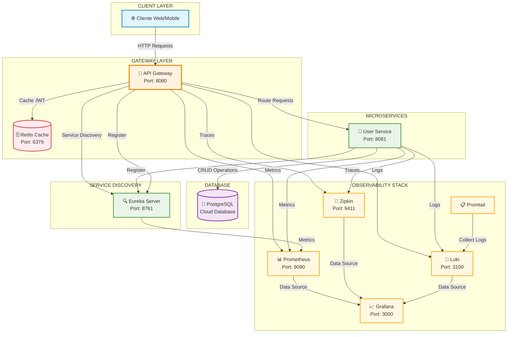
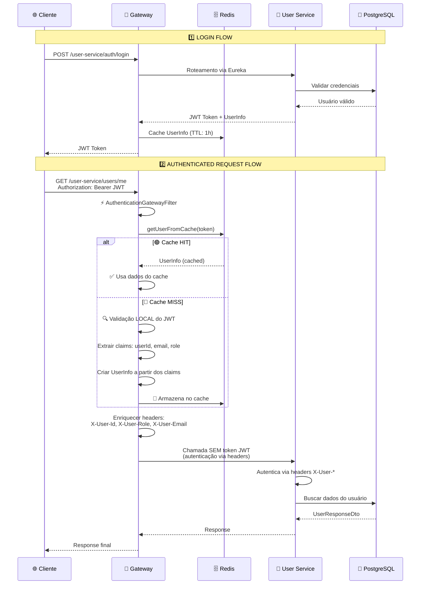

# 🏥 ClinicBoard - Sistema de Gestão Clínica com Microsserviços

[](https://openjdk.java.net/)
[](https://spring.io/projects/spring-boot)
[](https://docs.docker.com/compose/)
[](https://grafana.com/)

---

## 📌 Visão Geral

Sistema de gestão clínica baseado em **arquitetura de microsserviços** utilizando Spring Boot 3, com foco em **observabilidade**, **cache distribuído** e **descoberta de serviços**. O projeto implementa um gateway inteligente para roteamento de requisições e autenticação JWT com cache Redis para alta performance.

---

## 🏗️ Arquitetura do Sistema



---

## 🔄 Fluxo Detalhado de Requisições

### 🔐 Fluxo de Autenticação com Cache



---

## 🧰 Stack Tecnológica

### **🔧 Backend Core**
| Componente | Tecnologia | Versão | Porta |
|------------|------------|--------|-------|
| **Runtime** | Java | 17 LTS | - |
| **Framework** | Spring Boot | 3.2.x | - |
| **Gateway** | Spring Cloud Gateway | 4.1.x | 8080 |
| **Service Discovery** | Netflix Eureka | 4.1.x | 8761 |
| **Cache** | Redis | 7.x | 6379 |
| **Database** | PostgreSQL | 15+ | Cloud |

### **📊 Observabilidade**
| Componente | Tecnologia | Versão | Porta |
|------------|------------|--------|-------|
| **Métricas** | Prometheus | Latest | 9090 |
| **Dashboard** | Grafana | Latest | 3000 |
| **Traces** | Zipkin | Latest | 9411 |
| **Logs** | Loki + Promtail | 2.9.0 | 3100 |

### **🔒 Segurança & Autenticação**
- **JWT** para autenticação stateless
- **Cache Redis** para otimização de validação
- **Headers customizados** para propagação de contexto de usuário

---

## 📍 Estrutura do Projeto

```
clinicboard-backend/
├── 🚪 gateway/                    # API Gateway + Auth
├── 🔍 service-discovery/          # Eureka Server
├── 👤 user-service/              # Gestão de Usuários
├── 📊 _observability/            # Stack de Observabilidade
│   ├── prometheus.yml
│   ├── grafana/
│   │   └── provisioning/
│   │       ├── dashboards/
│   │       └── datasources/
│   └── promtail/
├── 🐳 docker-compose.yaml        # Orquestração
└── 📋 README.md
```

---

## 🚀 Como Executar

### **1️⃣ Pré-requisitos**
```bash
# Verificar versões
java -version    # Java 17+
mvn -version     # Maven 3.8+
docker --version # Docker 20+
```

### **2️⃣ Configurar Variáveis de Ambiente**
```bash
# Criar arquivo .env na raiz
cp .env.example .env

# Configurar PostgreSQL (use seu provedor cloud)
PGHOST=seu-host-postgresql
PGDATABASE=clinicboard
PGUSER=seu-usuario
PGPASSWORD=sua-senha
```

### **3️⃣ Executar com Docker**
```bash
# Subir toda a infraestrutura
docker-compose up -d

# Verificar se todos os serviços estão UP
docker ps

# Acompanhar logs
docker-compose logs -f
```

### **4️⃣ Verificar Serviços**
```bash
# Service Discovery
curl http://localhost:8761

# API Gateway Health
curl http://localhost:8080/actuator/health

# User Service (via Gateway)
curl http://localhost:8080/user-service/actuator/health

# Prometheus Metrics
curl http://localhost:9090

# Grafana Dashboard
# http://localhost:3000 (admin/admin)

# Zipkin Traces
curl http://localhost:9411

# Loki Logs
curl http://localhost:3100/ready
```

---

## 📊 Observabilidade & Monitoramento

### **🎯 Dashboard Grafana**
O projeto inclui um **dashboard profissional** com:

#### **🚦 STATUS GERAL DOS SERVIÇOS**
- Status UP/DOWN de todos os microsserviços
- Contadores de erros 5xx e 4xx em tempo real

#### **📈 PERFORMANCE E TRÁFEGO**
- Taxa de requisições HTTP/s por serviço
- Latência P95 e média de resposta

#### **🚨 MONITORAMENTO DE ERROS**
- Taxa de erros por status code (2xx/4xx/5xx)
- SLA - Disponibilidade percentual (99%+)

#### **💻 RECURSOS DO SISTEMA**
- CPU do sistema por serviço
- Memória JVM Heap utilizada
- Tempo de atividade (uptime)

#### **🗄️ CACHE REDIS & NEGÓCIO**
- Operações Redis por segundo
- Métricas de autenticação e operações de usuário

### **📊 Métricas Importantes**
```bash
# Request Rate
sum(rate(http_server_requests_seconds_count[1m])) by (instance)

# P95 Latency
histogram_quantile(0.95, sum(rate(http_server_requests_seconds_bucket[1m])) by (le))

# Error Rate
sum(rate(http_server_requests_seconds_count{status=~"5.."}[5m]))

# Cache Operations
rate(lettuce_command_completion_total{job="gateway"}[1m])
```

---

## 🔧 Configurações Importantes

### **Gateway - Roteamento**
```yaml
spring:
  cloud:
    gateway:
      routes:
        - id: user-service
          uri: lb://user-service
          predicates:
            - Path=/user-service/**
          filters:
            - StripPrefix=1
```

### **Eureka - Service Discovery**
```yaml
eureka:
  client:
    register-with-eureka: false
    fetch-registry: false
  server:
    enable-self-preservation: false
```

### **Redis - Cache Configuration**
```yaml
spring:
  data:
    redis:
      host: redis
      port: 6379
      timeout: 2000ms
```

---

## 🧠 Decisões Arquiteturais

### **✅ Banco de Dados Compartilhado**
- **PostgreSQL cloud** único para simplicidade
- Em produção: database per service pattern

### **✅ Cache Inteligente**
- **Redis** para cache de autenticação
- **TTL configurável** (default: 1 hora)
- **Fallback** para validação local do JWT

### **✅ Observabilidade Completa**
- **Métricas**: Prometheus + Grafana
- **Logs**: Loki + Promtail
- **Traces**: Zipkin
- **Dashboards**: Painéis profissionais pre-configurados

### **✅ Resiliência**
- **Circuit Breakers** em comunicações síncronas
- **Health Checks** em todos os serviços
- **Graceful degradation** com cache

---

## 🎯 Endpoints Principais

### **🔐 Autenticação**
```bash
# Login
POST /user-service/auth/login
Content-Type: application/json
{
  "email": "admin@clinic.com",
  "password": "123456"
}

# Registrar usuário
POST /user-service/auth/register
Content-Type: application/json
{
  "name": "João Silva",
  "email": "joao@clinic.com",
  "password": "123456",
  "role": "DOCTOR"
}
```

### **👤 Gestão de Usuários**
```bash
# Perfil do usuário autenticado
GET /user-service/users/me
Authorization: Bearer {jwt-token}

# Listar usuários (Admin)
GET /user-service/users
Authorization: Bearer {jwt-token}

# Atualizar perfil
PUT /user-service/users/me
Authorization: Bearer {jwt-token}
Content-Type: application/json
{
  "name": "Novo Nome",
  "email": "novo@email.com"
}
```

### **🔍 Health & Monitoring**
```bash
# Gateway Health
GET /actuator/health

# Service Discovery
GET http://localhost:8761

# Prometheus Metrics
GET /actuator/prometheus

# Traces Endpoint
GET /actuator/traces
```

---

## 🚀 Roadmap Futuro

### **📋 Próximas Features**
- [ ] **Business Service** - Gestão de agendamentos e pacientes
- [ ] **Notification Service** - Notificações via RabbitMQ


### **🔧 Melhorias Técnicas**
- [ ] **Database per Service** - Isolamento de dados
- [ ] **API Rate Limiting** - Controle de taxa
- [ ] **Service Mesh** - Istio para observabilidade avançada
- [ ] **Event Sourcing** - Para auditoria completa

### **📊 Observabilidade Avançada**
- [ ] **Alerting Rules** - Alertas automáticos no Grafana
- [ ] **Custom Dashboards** - Por domínio de negócio
- [ ] **Distributed Tracing** - Correlação completa entre serviços
- [ ] **Log Aggregation** - Busca avançada nos logs

---

## 📈 Métricas de Performance

### **🎯 SLAs Definidos**
- **Disponibilidade**: > 99.5%
- **Latência P95**: < 500ms
- **Error Rate**: < 1%
- **Time to Recovery**: < 5min

### **📊 Monitoramento Contínuo**
- **Health Checks** a cada 10s
- **Métricas** coletadas a cada 15s
- **Alertas** em tempo real
- **Dashboards** atualizados a cada 5s

---

## 🤝 Contribuição

### **🔀 Workflow**
1. **Fork** o projeto
2. **Criar branch** para feature (`git checkout -b feature/nova-feature`)
3. **Commit** suas mudanças (`git commit -m 'Add: nova feature'`)
4. **Push** para branch (`git push origin feature/nova-feature`)
5. **Abrir Pull Request**

### **📋 Padrões de Código**
- **Java**: Google Java Style Guide
- **Commits**: Conventional Commits
- **Testes**: Cobertura mínima de 80%
- **Documentação**: JavaDoc obrigatório

---

## ✒️ Autor

**Daniel Nogueira** - *Desenvolvedor Full Stack*  
🔗 [GitHub](https://github.com/NogueiraDan) | 💼 [LinkedIn](https://www.linkedin.com/in/daniel-nogueira99/)

### **💡 Sobre o Projeto**
Este projeto de POC visa demonstra conhecimentos em:
- **Arquitetura de Microsserviços**
- **Observabilidade e Monitoramento**
- **Cache Distribuído e Performance**
- **DevOps e Containerização**
- **Segurança e Autenticação**

---