# 🏥 ClinicBoard - Sistema de Gestão Clínica com Microsserviços

[](https://openjdk.java.net/)
[](https://spring.io/projects/spring-boot)
[](https://docs.docker.com/compose/)
[](https://grafana.com/)

---

## 📌 Visão Geral

Sistema de gestão clínica baseado em **arquitetura de microsserviços** utilizando Spring Boot 3, com foco em **observabilidade**, **cache distribuído** e **descoberta de serviços**. O projeto implementa um gateway inteligente para roteamento de requisições e autenticação JWT com cache Redis para alta performance.

---

## 🏗️ Arquitetura do Sistema


---

## 🔄 Fluxo Detalhado de Requisições

### 🔐 Fluxo de Autenticação com Cache

```mermaid
sequenceDiagram
    participant C as 🌐 Cliente
    participant G as 🚪 Gateway
    participant R as 🗄️ Redis
    participant U as 👤 User Service
    participant DB as 🐘 PostgreSQL

    Note over C,DB: 1️⃣ LOGIN FLOW
    C->>G: POST /user-service/auth/login
    G->>U: Roteamento via Eureka
    U->>DB: Validar credenciais
    DB-->>U: Usuário válido
    U-->>G: JWT Token + UserInfo
    G->>R: Cache UserInfo (TTL: 1h)
    G-->>C: JWT Token

    Note over C,DB: 2️⃣ AUTHENTICATED REQUEST FLOW
    C->>G: GET /user-service/users/me<br/>Authorization: Bearer JWT
    G->>G: ⚡ AuthenticationGatewayFilter
    G->>R: getUserFromCache(token)
    
    alt 🟢 Cache HIT
        R-->>G: UserInfo (cached)
        G->>G: ✅ Usa dados do cache
    else 🔴 Cache MISS
        G->>G: 🔍 Validação LOCAL do JWT
        G->>G: Extrair claims: userId, email, role
        G->>G: Criar UserInfo a partir dos claims
        G->>R: 💾 Armazena no cache
    end
    
    G->>G: Enriquecer headers:<br/>X-User-Id, X-User-Role, X-User-Email
    G->>U: Chamada SEM token JWT<br/>(autenticação via headers)
    U->>U: Autentica via headers X-User-*
    U->>DB: Buscar dados do usuário
    DB-->>U: UserResponseDto
    U-->>G: Response
    G-->>C: Response final
```



---

## 🧰 Stack Tecnológica

### **🔧 Backend Core**
| Componente | Tecnologia | Versão | Porta |
|------------|------------|--------|-------|
| **Runtime** | Java | 17 LTS | - |
| **Framework** | Spring Boot | 3.2.x | - |
| **Gateway** | Spring Cloud Gateway | 4.1.x | 8080 |
| **Service Discovery** | Netflix Eureka | 4.1.x | 8761 |
| **Cache** | Redis | 7.x | 6379 |
| **Database** | PostgreSQL | 15+ | Cloud |

### **📊 Observabilidade**
| Componente | Tecnologia | Versão | Porta |
|------------|------------|--------|-------|
| **Métricas** | Prometheus | Latest | 9090 |
| **Dashboard** | Grafana | Latest | 3000 |
| **Traces** | Zipkin | Latest | 9411 |
| **Logs** | Loki + Promtail | 2.9.0 | 3100 |

### **📨 Messaging & Events**
| Componente | Tecnologia | Versão | Porta |
|------------|------------|--------|-------|
| **Message Broker** | RabbitMQ | Latest | 5672 |
| **Job Scheduler** | Quartz | 2.3.x | - |
| **Circuit Breaker** | Resilience4j | 2.x | - |
| **Async Communication** | Spring AMQP | 3.x | - |

### **🔒 Segurança & Autenticação**
- **JWT** para autenticação stateless
- **Cache Redis** para otimização de validação
- **Headers customizados** para propagação de contexto de usuário

---

## 📍 Estrutura do Projeto

```
clinicboard-backend/
├── 🚪 gateway/                    # API Gateway + Auth
├── 🔍 service-discovery/          # Eureka Server
├── 👤 user-service/              # Gestão de Usuários
├── 🏥 business-service/          # Agendamentos & Pacientes
├── 📧 notification-service/      # Notificações via RabbitMQ
├── 📊 _observability/            # Stack de Observabilidade
│   ├── prometheus.yml
│   ├── grafana/
│   │   └── provisioning/
│   │       ├── dashboards/
│   │       └── datasources/
│   └── promtail/
├── 🐳 docker-compose.yaml        # Orquestração
└── 📋 README.md
```

---

## 🚀 Como Executar

### **1️⃣ Pré-requisitos**
```bash
# Verificar versões
java -version    # Java 17+
mvn -version     # Maven 3.8+
docker --version # Docker 20+
```

### **2️⃣ Configurar Variáveis de Ambiente**
```bash
# Criar arquivo .env na raiz
cp .env.example .env

# Configurar PostgreSQL (use seu provedor cloud)
PGHOST=seu-host-postgresql
PGDATABASE=clinicboard
PGUSER=seu-usuario
PGPASSWORD=sua-senha
```

### **3️⃣ Executar com Docker**
```bash
# Subir toda a infraestrutura
docker-compose up -d

# Verificar se todos os serviços estão UP
docker ps

# Acompanhar logs
docker-compose logs -f
```

### **4️⃣ Verificar Serviços**
```bash
# Service Discovery
curl http://localhost:8761

# API Gateway Health
curl http://localhost:8080/actuator/health

# User Service (via Gateway)
curl http://localhost:8080/user-service/actuator/health

# Prometheus Metrics
curl http://localhost:9090

# Grafana Dashboard
# http://localhost:3000 (admin/admin)

# Zipkin Traces
curl http://localhost:9411

# Loki Logs
curl http://localhost:3100/ready
```

---

## 📊 Observabilidade & Monitoramento

### **🎯 Dashboard Grafana**
O projeto inclui um **dashboard profissional** com:

#### **🚦 STATUS GERAL DOS SERVIÇOS**
- Status UP/DOWN de todos os microsserviços
- Contadores de erros 5xx e 4xx em tempo real

#### **📈 PERFORMANCE E TRÁFEGO**
- Taxa de requisições HTTP/s por serviço
- Latência P95 e média de resposta

#### **🚨 MONITORAMENTO DE ERROS**
- Taxa de erros por status code (2xx/4xx/5xx)
- SLA - Disponibilidade percentual (99%+)

#### **💻 RECURSOS DO SISTEMA**
- CPU do sistema por serviço
- Memória JVM Heap utilizada
- Tempo de atividade (uptime)

#### **🗄️ CACHE REDIS & NEGÓCIO**
- Operações Redis por segundo
- Métricas de autenticação e operações de usuário

### **📊 Métricas Importantes**
```bash
# Request Rate
sum(rate(http_server_requests_seconds_count[1m])) by (instance)

# P95 Latency
histogram_quantile(0.95, sum(rate(http_server_requests_seconds_bucket[1m])) by (le))

# Error Rate
sum(rate(http_server_requests_seconds_count{status=~"5.."}[5m]))

# Cache Operations
rate(lettuce_command_completion_total{job="gateway"}[1m])
```

---

## 🔧 Configurações Importantes

### **Gateway - Roteamento**
```yaml
spring:
  cloud:
    gateway:
      routes:
        - id: user-service
          uri: lb://user-service
          predicates:
            - Path=/user-service/**
          filters:
            - StripPrefix=1
        - id: business-service
          uri: lb://business-service
          predicates:
            - Path=/business-service/**
          filters:
            - StripPrefix=1
        - id: notification-service
          uri: lb://notification-service
          predicates:
            - Path=/notification-service/**
          filters:
            - StripPrefix=1
```

### **Eureka - Service Discovery**
```yaml
eureka:
  client:
    register-with-eureka: false
    fetch-registry: false
  server:
    enable-self-preservation: false
```

### **Redis - Cache Configuration**
```yaml
spring:
  data:
    redis:
      host: redis
      port: 6379
      timeout: 2000ms
```

### **Business Service - Domain Configuration**
```yaml
spring:
  jpa:
    hibernate:
      ddl-auto: update
    show-sql: false
  rabbitmq:
    host: rabbitmq
    port: 5672
    username: guest
    password: guest

# Configurações de Agendamento
appointment:
  working-hours:
    start: "08:00"
    end: "18:00"
  slot-duration: 30 # minutos
  advance-booking-days: 30
```

### **Notification Service - Messaging**
```yaml
spring:
  rabbitmq:
    exchanges:
      notification: notification.exchange
    queues:
      email: notification.email.queue
      sms: notification.sms.queue
    routing-keys:
      appointment-created: appointment.created
      appointment-reminder: appointment.reminder
```

---

## 🧠 Decisões Arquiteturais

### **✅ Banco de Dados Compartilhado**
- **PostgreSQL cloud** único para simplicidade
- Em produção: database per service pattern

### **✅ Cache Inteligente**
- **Redis** para cache de autenticação
- **TTL configurável** (default: 1 hora)
- **Fallback** para validação local do JWT

### **✅ Observabilidade Completa**
- **Métricas**: Prometheus + Grafana
- **Logs**: Loki + Promtail
- **Traces**: Zipkin
- **Dashboards**: Painéis profissionais pre-configurados

### **✅ Resiliência**
- **Circuit Breakers** em comunicações síncronas
- **Health Checks** em todos os serviços
- **Graceful degradation** com cache

### **✅ Event-Driven Architecture**
- **RabbitMQ** para comunicação assíncrona entre serviços
- **Domain Events** para notificações automáticas
- **Dead Letter Queue (DLQ)** para tratamento de falhas
- **Circuit Breakers** com fallback para operações críticas
- **Retry patterns** com backoff exponencial

### **✅ Domain-Driven Design**
- **Bounded Contexts** bem definidos (User, Business, Notification)
- **Value Objects** para validações de domínio (CPF, Email, Phone)
- **Aggregate Roots** para consistência de dados
- **Repository Pattern** para abstração de persistência

### **✅ Patterns Implementados**
- **Gateway Pattern** para roteamento centralizado
- **Service Discovery** para localização dinâmica de serviços
- **Cache-Aside Pattern** para otimização de performance
- **Saga Pattern** para transações distribuídas (futuro)

---

## 🎯 Endpoints Principais

### **🔐 Autenticação**
```bash
# Login
POST /user-service/auth/login
Content-Type: application/json
{
  "email": "admin@clinic.com",
  "password": "123456"
}

# Registrar usuário
POST /user-service/auth/register
Content-Type: application/json
{
  "name": "João Silva",
  "email": "joao@clinic.com",
  "password": "123456",
  "role": "DOCTOR"
}
```

### **👤 Gestão de Usuários**
```bash
# Perfil do usuário autenticado
GET /user-service/users/me
Authorization: Bearer {jwt-token}

# Listar usuários (Admin)
GET /user-service/users
Authorization: Bearer {jwt-token}

# Atualizar perfil
PUT /user-service/users/me
Authorization: Bearer {jwt-token}
Content-Type: application/json
{
  "name": "Novo Nome",
  "email": "novo@email.com"
}
```

### **🏥 Gestão de Agendamentos**
```bash
# Criar agendamento
POST /business-service/appointments
Authorization: Bearer {jwt-token}
Content-Type: application/json
{
  "patientId": 1,
  "doctorId": 2,
  "appointmentDate": "2024-12-20",
  "startTime": "14:30",
  "endTime": "15:00",
  "description": "Consulta de rotina"
}

# Listar agendamentos do dia
GET /business-service/appointments/today
Authorization: Bearer {jwt-token}

# Buscar horários disponíveis
GET /business-service/appointments/available-times?date=2024-12-20
Authorization: Bearer {jwt-token}

# Atualizar status do agendamento
PATCH /business-service/appointments/{id}/status
Authorization: Bearer {jwt-token}
Content-Type: application/json
{
  "status": "CONFIRMED"
}
```

### **👥 Gestão de Pacientes**
```bash
# Criar paciente
POST /business-service/patients
Authorization: Bearer {jwt-token}
Content-Type: application/json
{
  "name": "Maria Silva",
  "email": "maria@email.com",
  "phone": "(11) 99999-9999",
  "birthDate": "1985-03-15",
  "address": {
    "street": "Rua das Flores, 123",
    "city": "São Paulo",
    "zipCode": "01234-567"
  }
}

# Listar pacientes do usuário
GET /business-service/patients/user/{userId}
Authorization: Bearer {jwt-token}

# Buscar paciente por ID
GET /business-service/patients/{id}
Authorization: Bearer {jwt-token}

# Atualizar dados do paciente
PUT /business-service/patients/{id}
Authorization: Bearer {jwt-token}
Content-Type: application/json
{
  "name": "Maria Silva Santos",
  "phone": "(11) 88888-8888"
}
```

### **📧 Notificações**
```bash
# Enviar notificação manual
POST /notification-service/notifications/send
Authorization: Bearer {jwt-token}
Content-Type: application/json
{
  "userId": 1,
  "type": "APPOINTMENT_REMINDER",
  "message": "Lembrete: Consulta amanhã às 14:30",
  "channel": "EMAIL"
}

# Listar notificações do usuário
GET /notification-service/notifications/user/{userId}
Authorization: Bearer {jwt-token}

# Marcar notificação como lida
PATCH /notification-service/notifications/{id}/read
Authorization: Bearer {jwt-token}
```

### **🔍 Health & Monitoring**
```bash
# Gateway Health
GET /actuator/health

# Service Discovery
GET http://localhost:8761

# Prometheus Metrics
GET /actuator/prometheus

# Traces Endpoint
GET /actuator/traces
```

---

## 🚀 Roadmap do Projeto

### **📋 Features Implementadas** ✅
- [x] **Gateway Service** - Roteamento e autenticação centralizada
- [x] **User Service** - Gestão completa de usuários e autenticação JWT
- [x] **Service Discovery** - Registro e descoberta automática de serviços
- [x] **Business Service** - Gestão de agendamentos e pacientes
- [x] **Notification Service** - Notificações via RabbitMQ
- [x] **Observability Stack** - Prometheus, Grafana, Zipkin e Loki
- [x] **Cache Distribuído** - Redis para otimização de performance

### **📋 Próximas Features**
- [ ] **Database per Service** - Isolamento completo de dados por contexto
- [ ] **API Rate Limiting** - Controle de taxa por usuário/endpoint
- [ ] **Saga Orchestration** - Transações distribuídas consistentes
- [ ] **API Versioning** - Versionamento semântico dos endpoints

### **🔧 Melhorias Técnicas**
- [ ] **Service Mesh** - Istio para observabilidade avançada
- [ ] **Event Sourcing** - Para auditoria completa
- [ ] **CQRS Pattern** - Separação de comandos e consultas
- [ ] **Multi-Tenancy** - Suporte para múltiplas clínicas

### **📊 Observabilidade Avançada**
- [ ] **Alerting Rules** - Alertas automáticos no Grafana
- [ ] **Custom Dashboards** - Por domínio de negócio
- [ ] **Distributed Tracing** - Correlação completa entre serviços
- [ ] **Log Aggregation** - Busca avançada nos logs

---

## 📈 Métricas de Performance

### **🎯 SLAs Definidos**
- **Disponibilidade**: > 99.5%
- **Latência P95**: < 500ms
- **Error Rate**: < 1%
- **Time to Recovery**: < 5min

### **📊 Monitoramento Contínuo**
- **Health Checks** a cada 10s
- **Métricas** coletadas a cada 15s
- **Alertas** em tempo real
- **Dashboards** atualizados a cada 5s

---

## 🤝 Contribuição

### **🔀 Workflow**
1. **Fork** o projeto
2. **Criar branch** para feature (`git checkout -b feature/nova-feature`)
3. **Commit** suas mudanças (`git commit -m 'Add: nova feature'`)
4. **Push** para branch (`git push origin feature/nova-feature`)
5. **Abrir Pull Request**

### **📋 Padrões de Código**
- **Java**: Google Java Style Guide
- **Commits**: Conventional Commits
- **Testes**: Cobertura mínima de 80%
- **Documentação**: JavaDoc obrigatório

---

## ✒️ Autor

**Daniel Nogueira** - *Desenvolvedor Full Stack*  
🔗 [GitHub](https://github.com/NogueiraDan) | 💼 [LinkedIn](https://www.linkedin.com/in/daniel-nogueira99/)

### **💡 Sobre o Projeto**
Este projeto de POC visa demonstra conhecimentos em:
- **Arquitetura de Microsserviços**
- **Observabilidade e Monitoramento**
- **Cache Distribuído e Performance**
- **DevOps e Containerização**
- **Segurança e Autenticação**

---